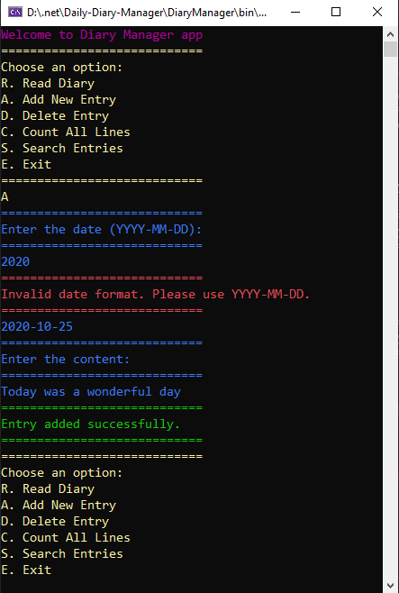

# Daily Diary Console Application

## Overview

The Daily Diary Console Application allows users to manage a daily diary text file. Users can read, add, delete, count, and search diary entries through a simple console interface.

## Features

1. **Read Diary**: This feature allows users to view all the entries in their diary..
2. **Add Entry**: Users can add a new diary entry, specifying the date and content.
3. **Delete Entry**: This feature enables users to delete an existing entry using a specified date.
4. **Count Lines**: Users can determine the total number of lines in their diary.
5. **Search Entries**: This feature helps users to search for diary entries based on a specific date.

### Menu Options

1. **Read Diary**: Shows all the diary entries.
2. **Add Entry**: Asks for a date (in YYYY-MM-DD format) and content to create a new diary entry.
3. **Delete Entry**: Asks for a date (in YYYY-MM-DD format) to remove a particular diary entry.
4. **Count Lines**: Shows the total number of lines present in the diary.
5. **Search Entries**: Asks for a date (in YYYY-MM-DD format) to find specific diary entries.
6. **Exit**: Ends the application.

## Date Format

All dates must be in the `YYYY-MM-DD` format. The application validates the date format before performing any operations.

## Error Handling

The application includes error handling for file operations and invalid user inputs.

## Unit Tests

Unit tests are provided using Xunit to verify the core functionalities of the application.
